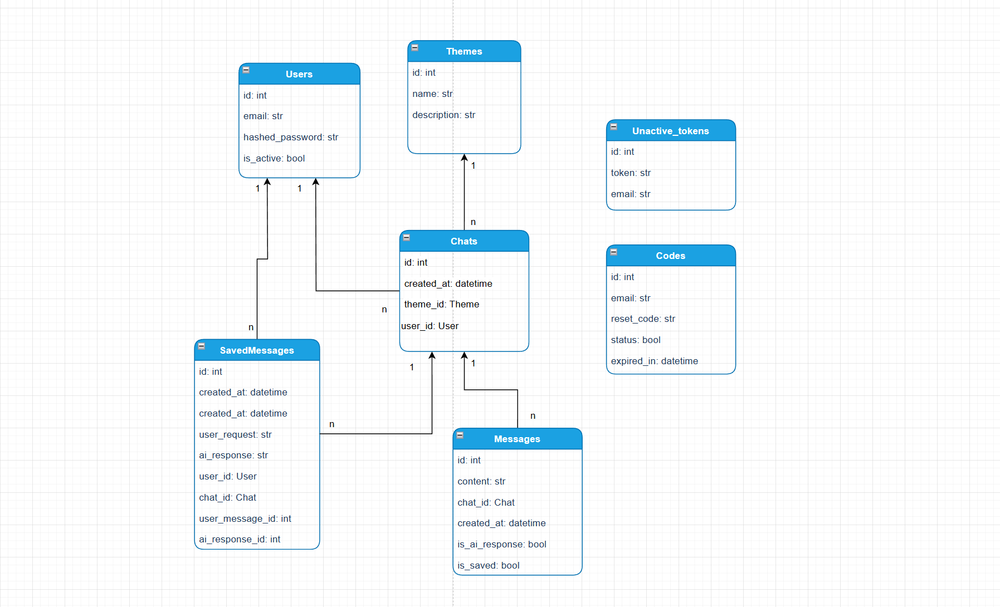
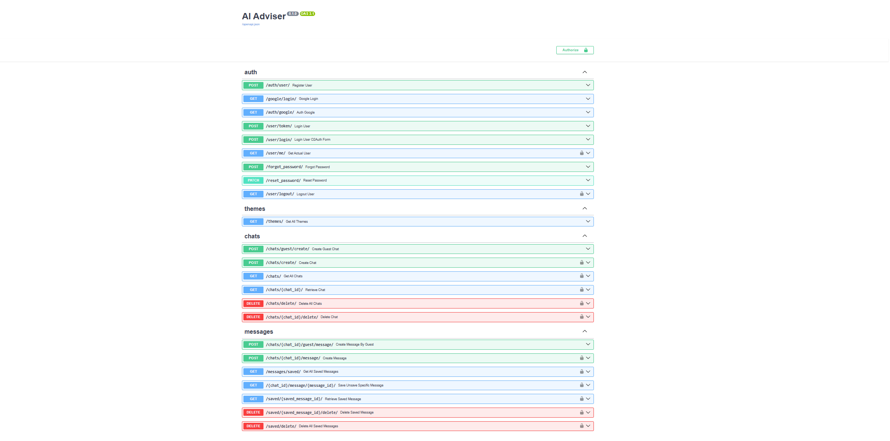

# AI Adviser API Service

### About project:

The AI Adviser API Service is a FastAPI-based platform that allows users to interact with artificial intelligence on
predefined topics.
It offers robust features for chat management, user authentication, and AI-powered responses.

### Features

* User Authentication
    * JWT-based authentication for secure access.
    * Login and logout functionality.
    * Google OAuth for quick and secure login.
    * Password reset through email confirmation.


* Chat Management
    * Manage chats for authenticated users.
    * Support for guest users to create chats with specific restrictions.
    * Maintain chat history for existing users.
    * Save or unsave specific messages from chats.
    * Access and manage saved messages, even if the chat is deleted.


* AI Integration
    * Uses OpenAI API for intelligent responses on predefined topics

### Technologies that were included to this project:

* FastAPI: High-performance framework for building APIs.
* Alembic: Database migration tool.
* Pydantic: Data validation and settings management.
* PostgreSQL: Production database for secure and scalable data storage.
* JWT Auth: Token-based user authentication.
* Swagger: Built-in API documentation for easy exploration and testing.
* Google OAuth: Secure third-party authentication with Google.
* OpenAI API: Integration for generating AI-powered responses.

### How to run:

#### Using GitHub

```bash
git clone https://github.com/mwellick/ai-adviser-api-v-1.1.git
cd ai-adviser-api-v-1.1

#For Windows
python -m venv venv 
.\venv\Scripts\activate 

#for MacOS/Linux
python3 -m venv venv 
source venv/bin/activate

# If you're on MacOS, make sure to remove `psycopg2` from requirements.txt before installing dependencies.
# You can do this by opening requirements.txt and deleting the line with `psycopg2`.

#Don't forget to create .env file and add the following env.variables form .env.sample file 
# Then proceed with the following:
pip install -r requirements.txt

# Apply migrations and run the server
alembic upgrade head
uvicorn app.main:app --reload
```

### API Documentation:

* Swagger: Visit http://127.0.0.1:8000 for an interactive API documentation interface.

### Production URL

You can also try the production version of the service, you can access it here:

[Production API](https://interior-arluene-mwellick-4212a5bc.koyeb.app)

### Frontend Application

Additionally, you can try the frontend application here, connected to this API:

[Frontend App](https://adviser-elli.netlify.app)


### DB Structure



### Swagger



